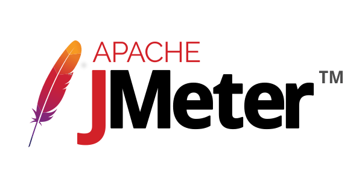
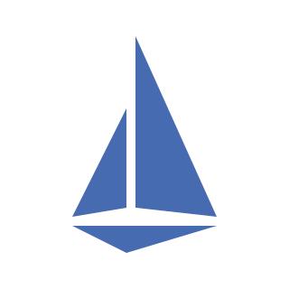

<!-- Banner -->

  

<!-- Header -->
<h1 align="center">Hi there! 👋 I'm Rachakonda Dharmendra</h1>
<h3 align="center">A passionate DevOps Engineer</h3>

<!-- Badges -->

  
  
  

<!-- About Me -->

  <samp>
    I'm a DevOps Engineer with a passion for building scalable and reliable systems. Proficient in various cloud platforms, containerization technologies, and automation tools, I strive to streamline software delivery processes and enhance operational efficiency.
  </samp>

<!-- Tech Stack -->
<h2 align="center">🚀 Tech Stack</h2>

  
  
  
  
  
  
  
  
  
  
  
  
  
  
  

<!-- GitHub Stats -->
<h2 align="center">📊 GitHub Stats</h2>

  
  
  

<!-- Contact Me -->
<h2 align="center">💬 Connect with Me</h2>

  <samp>
    Feel free to reach out to me for any collaboration, discussion, or just a friendly chat!
  </samp>

  

<!-- Footer -->

  <samp>
    Made with ❤️ by Rachakonda Dharmendra
  </samp>

